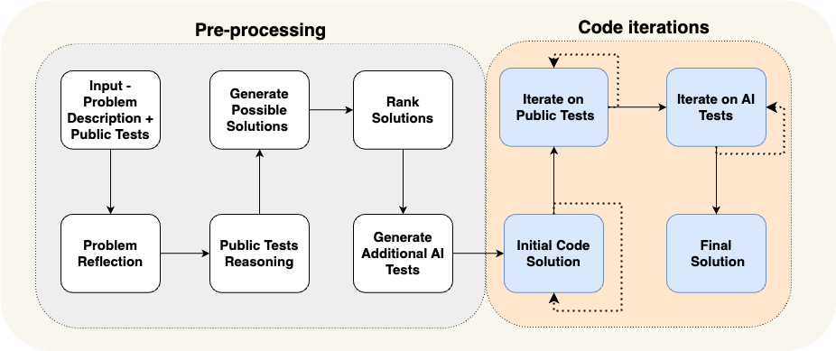
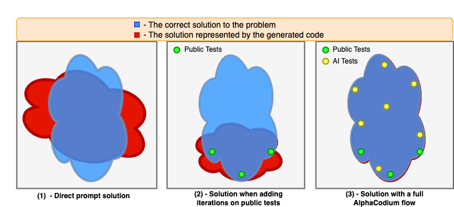
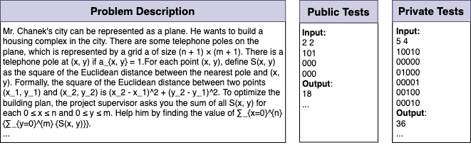

# Code Generation with AlphaCodium: From Prompt Engineering to Flow Engineering

[Paper](https://arxiv.org/abs/2009.14119) |
[Dataset](https://huggingface.co/datasets/talrid/CodeContests_valid_and_test_AlphaCodium/blob/main/codecontests_valid_and_test_processed_alpha_codium.zip)


> Tal Ridnik, Dedy Kredo, Itamar Friedman <br/> CodiumAI

**Abstract**

Code generation problems differ from common natural language problems - they require matching the exact syntax of the target language, identifying happy paths and edge cases, paying attention to numerous small details in the problem spec, and addressing other code-specific issues and requirements. Hence, many of the optimizations and tricks that have been successful in natural language generation may not be effective for code tasks.

In this work, we propose a new approach to code generation by LLMs, which we call AlphaCodium - a test-based, multi-stage, code-oriented iterative flow, that improves the performances of LLMs on code problems.

We tested AlphaCodium on a challenging code generation dataset called CodeContests, which includes competitive programming problems from platforms such as Codeforces. The proposed flow consistently and significantly improves results.
On the validation set, for example, GPT-4 accuracy (pass@5) increased from 19% with a single well-designed direct prompt to 44% with the AlphaCodium flow. 

Many of the principles and best practices we acquired in this work, we believe, are broadly applicable to general code generation tasks.

<p align="center">
 <table class="tg">
  <tr>
    <td class="tg-c3ow"></td>
<tr>
    <td class="tg-c3ow"></td>

  </tr>
</table>
</p>


## Installation

(1) setup a virtual environment and run: `pip install -r requirements.txt`

(2) Duplicate the file `alpha_codium/settings/.secrets_template.toml`, rename it as `.secrets.toml`, and fill your openai api key:
```
[openai]
key = "..."
```

(3) Download the processed CodeContest validation and test dataset from [hugging face](https://huggingface.co/datasets/talrid/CodeContests_valid_and_test_AlphaCodium/blob/main/codecontests_valid_and_test_processed_alpha_codium.zip), extract the zip file, and placed the extracted folder in the root of the project.

## How to run

### Configuration
The file: `alpha_codium/settings/configuration.toml` contains the configuration for the project.

### Solving a specific problem
To solve a specific problem with AlphaCodium, from the root folder run:
```
python -m alpha_codium.solve_problem \
--dataset_name /path/to/dataset \
--split_name test \
--problem_number 0
```
- The `dataset_name` is the path to the dataset folder you downloaded in the installation step.
- Note that the validation set contain 117 problems, and the test set contain 165 problems, so the `problem_number` parameter should be accordingly (zero-based)
- The `split_name` can be either `valid` or `test`.
- The followings sections in the configuration file: 
`solve`, `self_reflection`,`possible_solutions`,`generate_ai_tests`,`initial_code_generation`,`public_tests`, `ai_tests`  
enable to adjust possible configurations for the different stages of the flow.

Example problem (test set, problem number 12):
<p align="center">
 <table class="tg">
  <tr>
    <td class="tg-c3ow"></td>
    </tr>
</table>
</p>

### Solving the entire dataset
to solve the entire dataset with AlphaCodium, from the root folder run:
```
python -m alpha_codium.solve_dataset \
--dataset_name /path/to/dataset \
--split_name test
--database_solution_path /path/to/output/dir/dataset_output.json
```

- The `split_name` can be either `valid` or `test`.
- `database_solution_path` is the path to the directory where the solutions will be saved.
- The `dataset` section in the configuration file contains the configuration for the running and evaluation a dataset.

### Running the evaluation

Once you generate a solution for the entire dataset (valid or test), you can evaluate it by running:
```
python -m alpha_codium.evaluate_dataset\
--dataset_name /path/to/dataset\
--split_name test\
--database_solution_path /path/to/output/dir/dataset_output.json
```

## Acknowledgments
Our process CodeContests dataset is based on the original [CodeContests](https://huggingface.co/datasets/deepmind/code_contests) dataset.
We removed the train set (which is not relevant for our work), and did some post-processing and cleaning to the validation and test sets.


## Citation
```
 @misc{benbaruch2020asymmetric, 
        title={Asymmetric Loss For Multi-Label Classification}, 
        author={Emanuel Ben-Baruch and Tal Ridnik and Nadav Zamir and Asaf Noy and Itamar Friedman and Matan Protter and Lihi Zelnik-Manor}, 
        year={2020}, 
        eprint={2009.14119},
        archivePrefix={arXiv}, 
        primaryClass={cs.CV} }
```